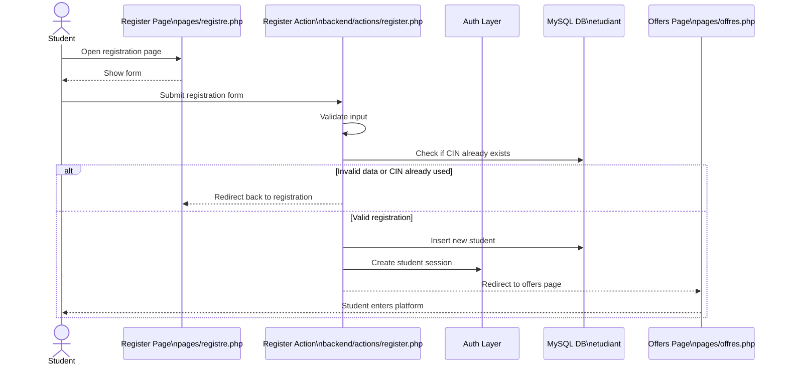
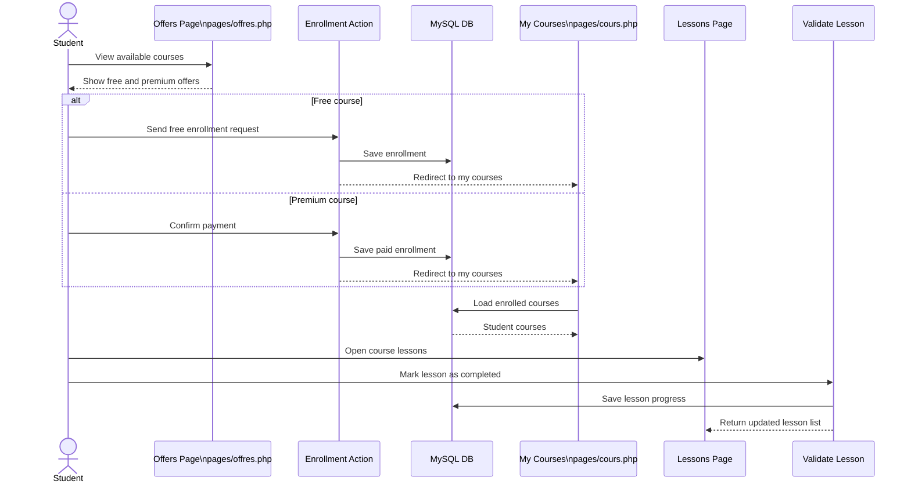
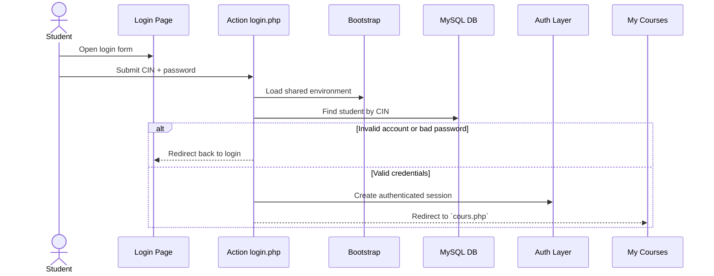
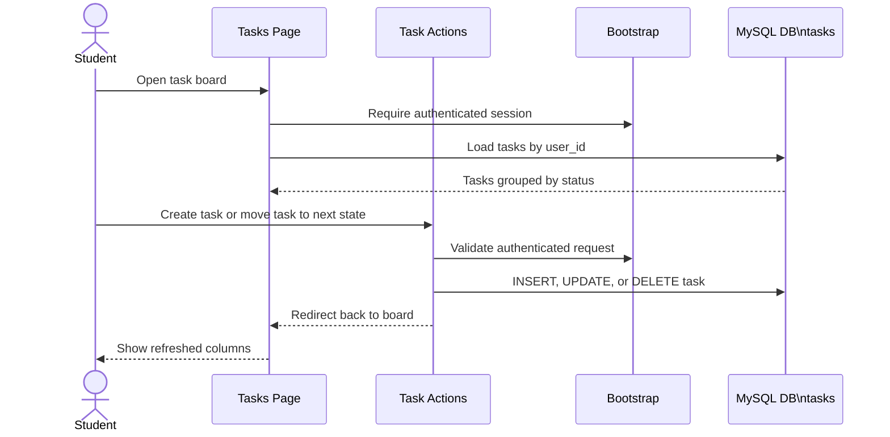
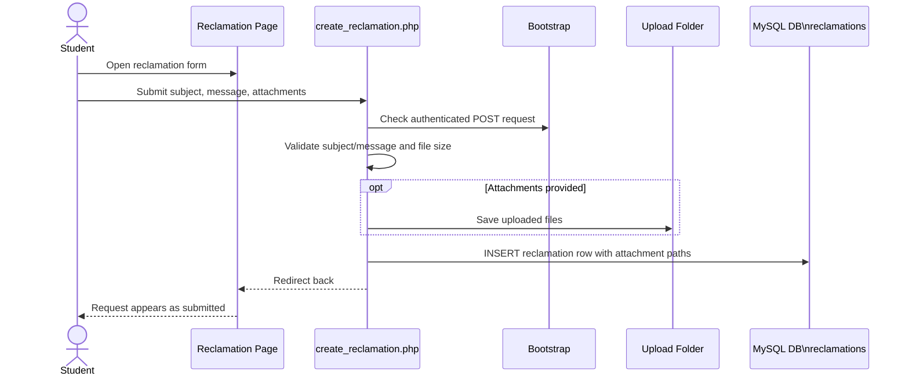
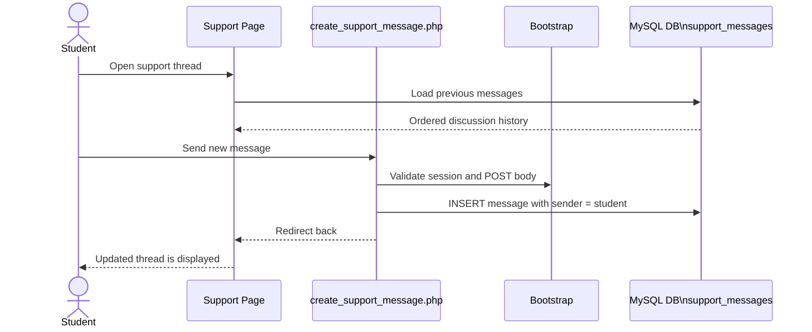
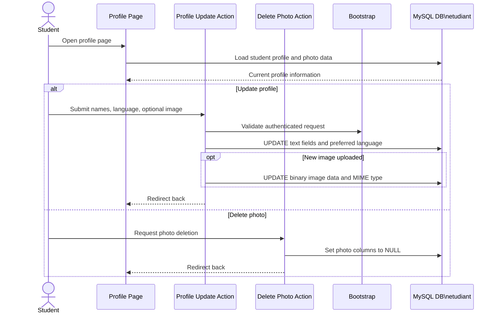
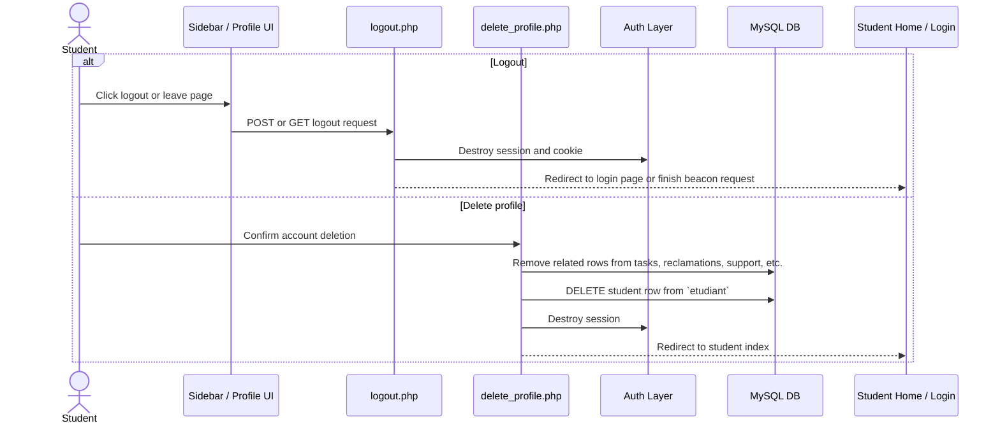

# Student Sequence Diagrams

This file groups the main sequence diagrams for the `kmr/student` module.

PlantUML separate files are available in:
- `kmr/student/plantuml/`

Main detailed diagrams:
- Detailed Diagram 1: student registration and authenticated session start
- Detailed Diagram 2: course enrollment and lesson progression

Other diagrams are intentionally lighter.

## Main Diagram 1: Registration And Session Start

Source flow:
- UI page: `pages/registre.php`
- Action: `backend/actions/register.php`
- Shared layer: `backend/includes/bootstrap.php`, `auth.php`, `session.php`, `helpers.php`

## Main Diagram 2: Course Enrollment And Lesson Progression

Source flow:
- UI pages: `pages/offres.php`, `pages/cours.php`, `pages/lesson(a).php`, `pages/visualiser_leçon.php`
- Actions: `backend/actions/enroll_free_course.php`, `backend/actions/traitter_payement(a).php`, `backend/actions/valider_lesson.php`

## Light Diagram 3: Login

## Light Diagram 4: Task Management

Grouped actions:
- `create_task.php`
- `update_task_status.php`
- `toggle_task.php`

## Light Diagram 5: Reclamation With Attachments

## Light Diagram 6: Support Chat Message

## Light Diagram 7: Profile Update And Photo Management

Grouped actions:
- `update_profile_settings.php`
- `delete_photo.php`

## Light Diagram 8: Logout And Profile Deletion

Grouped actions:
- `logout.php`
- `delete_profile.php`

## Coverage Summary

These diagrams cover the main student-side flows present in `kmr/student`:
- registration
- login
- free enrollment
- premium enrollment/payment
- course access
- lesson validation and progression
- task management
- reclamation
- support messaging
- profile update
- photo deletion
- logout
- profile deletion
